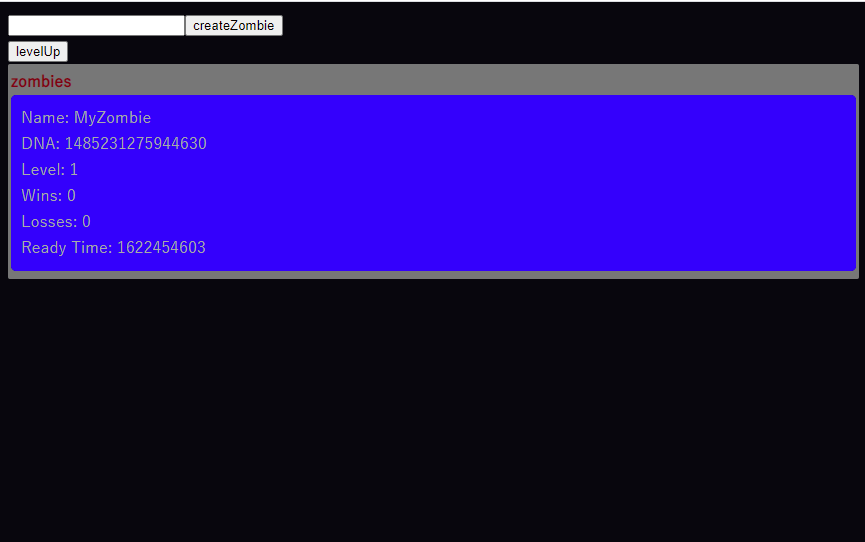

# Crypto Truffle Zombies

Solidity の学習用に truffle で開発環境を作成し、cryptozombies を写経して動作確認してみました。  
[https://github.com/trufflesuite/truffle](truffle)  
[https://cryptozombies.io/](cryptozombies)

# Getting Started

## 0.事前準備

### Metamask インストール

ブラウザ拡張でウォレットの機能を提供する Metamask をインストールします。MetaMask 9.5.7 で動作を確認しています。
https://chrome.google.com/webstore/detail/metamask/nkbihfbeogaeaoehlefnkodbefgpgknn

### npm インストール

npm をインストールします。  
https://www.npmjs.com/

### truffle

solidity の開発環境として truffle を使用するので npm でグローバルインストールしておきます。
https://www.trufflesuite.com/docs/truffle/overview

```
$ npm install -g truffle
```

### Ganache インストール

ethereum の開発用のネットワークとして Ganache を使用するのでインストールしておきます。
https://www.trufflesuite.com/ganache

## 1.Ganache 起動

Ganache を起動します。起動後に QuickStart を選択しネットワークを立ち上げます。

## 2.Metamask でアカウントを作成

接続先のネットワークは Ganache で QuickStart の場合"http://127.0.0.1:7545"のはずで、ネットワークの選択から"カスタムRPC"から追加します。

## 3.Truffle のコンパイルおよびマイグレート

次に以下のコマンドで solidity で記述したスマートコントラクトを compie します。

```
$ truffle compile
```

コンパイル後は`build\contracts`ディレクトリに json ファイルが作成されます。こちらは ABI の定義が含まれており、テストネットワークへのデプロイおよびブラウザからリクエストを飛ばすための読み込む対象のファイルとなります。

それからマイグレートコマンドでデプロイします。

```
$ truffle migrate
Compiling your contracts...
===========================
> Everything is up to date, there is nothing to compile.


Starting migrations...
======================
> Network name:    'development'
～省略～
   Replacing 'ZombieOwnership'
   ---------------------------
   > transaction hash:    0xd352bada7b5ccdbbb1bb1c08eabef95d73e077bac27b8bfba343facbcddc68da
   > Blocks: 0            Seconds: 0
   > contract address:    0x530b885d245Ed2823f7BEEBeba30e81e23f1001c
   > block number:        7
   > block timestamp:     1622366173
   > account:             0x98401094a1C4D7dBb8Ab83b35ffC7FD27a05FF60
   > balance:             99.856816
   > gas used:            2037350 (0x1f1666)
   > gas price:           20 gwei
   > value sent:          0 ETH
   > total cost:          0.040747 ETH

   > Saving artifacts
   -------------------------------------
   > Total cost:            0.143184 ETH


Summary
=======
> Total deployments:   7
> Final cost:          0.143184 ETH
```

マイグレートしたらこのようにトランザクションの内容と cost が出力されます。今回動作確認対象のコントラクトは`ZombieOwnership`なのですが、デプロイしたコントラクトのアドレス(今回は"0x530b885d245Ed2823f7BEEBeba30e81e23f1001c")はフロントエンドから呼び出すのに必要なので控えておきます。

またこの時、Ganache 上からでもトランザクションの内容が確認できます。  


## 4.フロントエンドにコントラクトのアドレスを設定

フロントエンドのコントラクトアドレスを`front/.env.json`に設定しておいたのでマイグレート時に出力された内容で編集します。

```
{
    "CONTRACT_ADDRESS": "0x530b885d245Ed2823f7BEEBeba30e81e23f1001c"
}
```

## 5.フロントエンドを起動

```
$ cd front
$ npm install
$ npm run dev
```

### 6.動作確認

動作確認では Metamask のアカウントの一番目を使用するので、etherum を保持していない場合、Ganache のアカウントをインポートして送金しておく。また、スマートコントラクトの実行でエラーが発生する場合、"設定 → 詳細 → アカウントをリセット"を実行する。

#### ゾンビ作成

テキストエリアの名前を入力し createZombie をクリックすると、以下のように Metamask のポップアップが表示されるので確認をクリックし承認します。


スマートコントラクトの実行に成功すると以下のように作成したゾンビが表示されます。　　


この時のトランザクション内容は Metamask にも表示されます。

